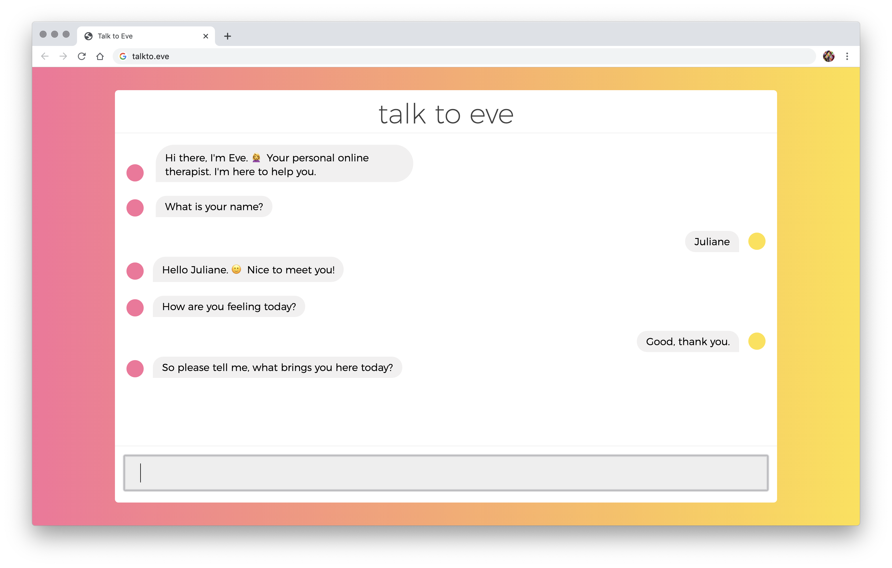

# Talk to Eve

Talk to Eve is a simple chat-bot where a personal online therapist interacts and helps users.

This project was made as part of the selection process to enter the [Codeworks](http://codeworks.me/) bootcamp.

The requisites for this assignment were:

- Build a simple chat application using HTML, CSS, JavaScript and jQuery. It is a single page, that opens in the browser, and shows the messages in colored bubbles (think something like WhatsApp). On one side the computer will generate a random conversation, on the other side the user can post messages. The screen automatically flows and follows the messages posted, like in all chat apps.

## Screenshot

## Author

Juliane Nagao - [GitHub](https://github.com/junagao) - [LinkedIn](https://www.linkedin.com/in/junagao/)

## License

This project is licensed under the MIT License.
